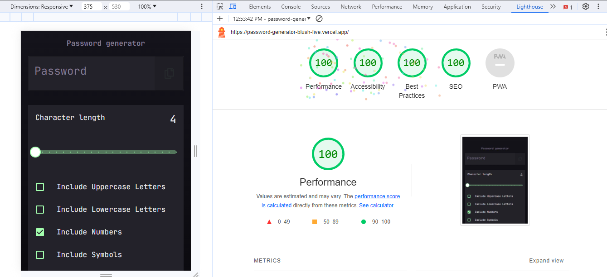
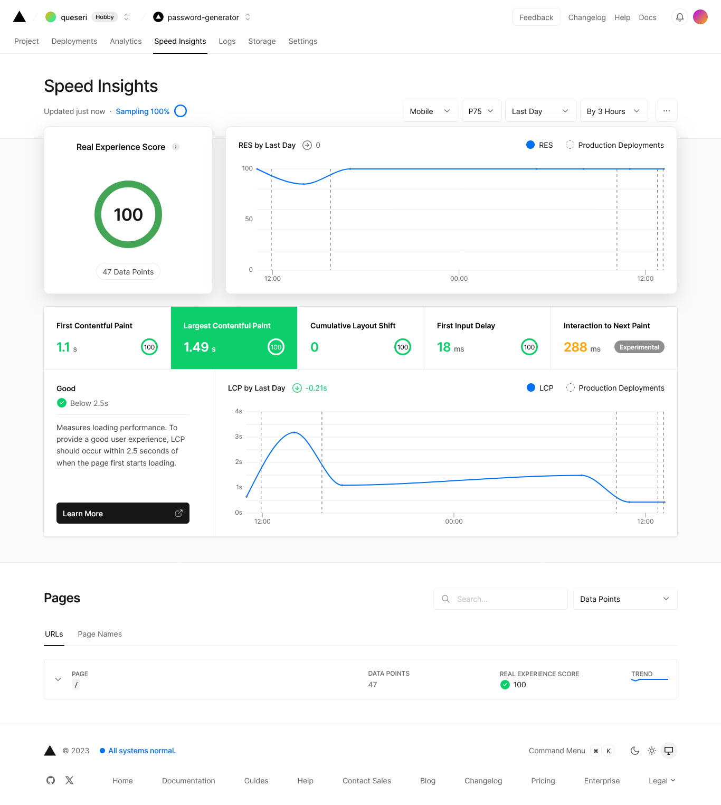

# Frontend Mentor - Password generator app solution

This is my solution to the [Password generator app challenge on Frontend Mentor](https://www.frontendmentor.io/challenges/password-generator-app-Mr8CLycqjh). Frontend Mentor challenges help you improve your coding skills by building realistic projects.

## Table of contents

- [Overview](#overview)
  - [The challenge](#the-challenge)
  - [Screenshot](#screenshot)
  - [Links](#links)
- [My process](#my-process)
  - [Built with](#built-with)
  - [What I learned](#what-i-learned)
  - [Continued development](#continued-development)
  - [Useful resources](#useful-resources)
- [Author](#author)
- [Acknowledgments](#acknowledgments)

## Overview

I took this challenge to practice using the ReactJs Framework NextJs. I used the NextJs docs by mainly following the
following tutorial [Create your nextjs app](https://nextjs.org/learn/basics/create-nextjs-app)

### The challenge

Users should be able to:

- Generate a password based on the selected inclusion options
- Copy the generated password to the computer's clipboard
- See a strength rating for their generated password
- View the optimal layout for the interface depending on their device's screen size
- See hover and focus states for all interactive elements on the page

### Screenshot

The screenshots where created using [Mobile simulator extension](https://chrome.google.com/webstore/detail/simulateur-mobile/ckejmhbmlajgoklhgbapkiccekfoccmk?hl=en-US)

  Mobile        

### Links

- Live Site URL: [Password generator app](https://password-generator-queseri.vercel.app/)

## My process

### Built with

- Semantic HTML5 markup
- CSS custom properties
- Flexbox
- CSS Grid
- Mobile-first workflow
- [React](https://reactjs.org/) - JS library
- [Next.js](https://nextjs.org/) - React framework
- [TailwindCSS](https://tailwindcss.com/)
- [Matrial-ui](https://mui.com/)

### What I learned

#### Customizing Material-ui font with Next js

I started this project to practice using Next.js by following the Next.js documentation tutorials.  Some of the main advantages of using Next.js is its inbuilt features that optimises images and fonts. Font optimisation is done through `next/font` which will automatically optimize fonts (including custom fonts) and remove external network requests for improved privacy and performance. The following video gives an introduction on [Using Fonts in Next.js (Google Fonts, Local Fonts, Tailwind CSS)](https://www.youtube.com/watch?v=L8_98i_bMMA)
The process includes the following steps:

- install next/font by running `npm install @next/font` on the terminal
- import the font you want to use in the layout.js file, here I used `import { JetBrains_Mono } from "next/font/google";`
- define a new instance of the imported font

``` js
const jetBrainsMono = JetBrains_Mono({
    subsets: ["latin"],
    preload: true,
    variable: "--font-jet-brains-mono",
    display: "swap",
});
```

- then wrap the parent component as shown below. The font will be applied to all the children of the wrapped element

``` js
export default function RootLayout({ children }) {
    return (
        <html lang="en">
            <body className={jetBrainsMono.className}>{children}</body>
        </html>
    );
}
```

Now, in this project , I am using `material-ui`  components for some of the elements. The issue was that the `Next font` was being automatically overwitten with the default material-ui font settings. The solution that I found after some research involves the following steps:

- creating a folder in the components folder that is called `ThemeRegistry`.
- In the `ThemeRegistry` folder , create two files called `theme.js` and `ThemeRegistry.js`.
- the `theme.js` will contain the font imports from the `layout.js` as shown below:

``` js
import { JetBrains_Mono } from "next/font/google";
import { createTheme } from "@mui/material";

const jetBrainsMono = JetBrains_Mono({
    subsets: ["latin"],
    preload: true,
    variable: "--font-jet-brains-mono",
    display: "swap",
});

const theme = createTheme({
    palette: {},
    typography: {
        fontFamily: jetBrainsMono.style.fontFamily,
    },
});

theme.typography.button = {
    fontFamily: jetBrainsMono.style.fontFamily,
    textTransform: "uppercase",
    fontWeight: 700,   
};

export default theme;
```

- import the `theme` in the `ThemeRegistry` and use it as shown below:

```js
'use client';
import * as React from 'react';
import { ThemeProvider } from '@mui/material/styles';
import CssBaseline from '@mui/material/CssBaseline';
import theme from './theme';

export default function ThemeRegistry({ children }) {
  return (  
      <ThemeProvider theme={theme}>
        {/* CssBaseline kickstart an elegant, consistent, and simple baseline to build upon. */}
        <CssBaseline />
        {children}
      </ThemeProvider>
   
  );
}

```

- import the `ThemeRegistry` in the `layout.js` file  and use it as shown below

``` js
import "./globals.css";
import ThemeRegistry from "@/components/ThemeRegistry/ThemeRegistry";

export const metadata = {
    title: "Password random generator",
    description: "Generated by create next app",
};

export default function RootLayout({ children }) {
    return (
        <html lang="en">
            <body>               
                <ThemeRegistry>{children}</ThemeRegistry>
            </body>
        </html>
    );
}
```

[Overriding Material-ui font settings](https://github.com/mui/material-ui/blob/master/examples/material-ui-nextjs/src/components/ThemeRegistry/ThemeRegistry.js)

### Customising the input range `element

[create-custom-range-input-consistent-browsers](https://www.smashingmagazine.com/2021/12/create-custom-range-input-consistent-browsers/)

### Copy to Clipboard

[React copy to clopboard](https://www.scaler.com/topics/react/react-copy-to-clipboard/)

### Lighthouse score



### Vercel speed insights



### Continued development

### Useful resources

## Author

- Website - [Chamu Mutezva](https://github.com/ChamuMutezva)
- Frontend Mentor - [@ChamuMutezva](https://www.frontendmentor.io/profile/ChamuMutezva)
- Twitter - [@ChamuMutezva](https://twitter.com/ChamuMutezva)

## Acknowledgments
