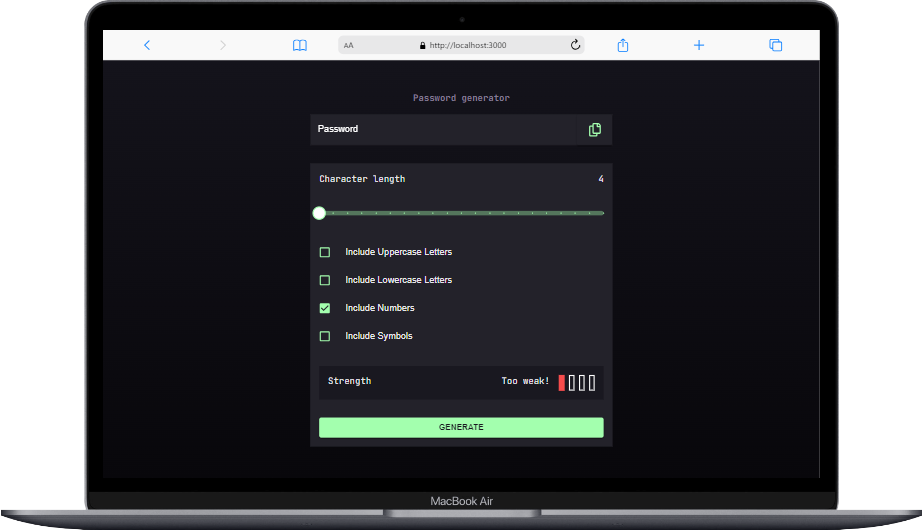

# Frontend Mentor - Password generator app solution

This is my solution to the [Password generator app challenge on Frontend Mentor](https://www.frontendmentor.io/challenges/password-generator-app-Mr8CLycqjh). Frontend Mentor challenges help you improve your coding skills by building realistic projects.

## Table of contents

- [Overview](#overview)
  - [The challenge](#the-challenge)
  - [Screenshot](#screenshot)
  - [Links](#links)
- [My process](#my-process)
  - [Built with](#built-with)
  - [What I learned](#what-i-learned)
  - [Continued development](#continued-development)
  - [Useful resources](#useful-resources)
- [Author](#author)
- [Acknowledgments](#acknowledgments)

## Overview

I took this challenge to practice using the ReactJs Framework NextJs. I used the NextJs docs by mainly following the
following tutorial [Create your nextjs app](https://nextjs.org/learn/basics/create-nextjs-app)

### The challenge

Users should be able to:

- Generate a password based on the selected inclusion options
- Copy the generated password to the computer's clipboard
- See a strength rating for their generated password
- View the optimal layout for the interface depending on their device's screen size
- See hover and focus states for all interactive elements on the page

### Screenshot

The screenshots where created using [Mobile simulator extension](https://chrome.google.com/webstore/detail/simulateur-mobile/ckejmhbmlajgoklhgbapkiccekfoccmk?hl=en-US)

- Huawei 
- Mobile 
- Oppo 
- Samsung 
- Iphone 5 
- Iphone 12 
- Ipad 
- Iphone Macbook 
- Microsoft 

### Links

- Live Site URL: [Password generator app](https://password-generator-queseri.vercel.app/)

## My process

### Built with

- Semantic HTML5 markup
- CSS custom properties
- Flexbox
- CSS Grid
- Mobile-first workflow
- [React](https://reactjs.org/) - JS library
- [Next.js](https://nextjs.org/) - React framework
- [TailwindCSS](https://tailwindcss.com/)
- [Matrial-ui](https://mui.com/)

### What I learned

#### Customizing Material-ui font with Next js

[Overriding Material-ui font settings](https://github.com/mui/material-ui/blob/master/examples/material-ui-nextjs/src/components/ThemeRegistry/ThemeRegistry.js)

### Customising the input range `element

[create-custom-range-input-consistent-browsers](https://www.smashingmagazine.com/2021/12/create-custom-range-input-consistent-browsers/)

### Copy to Clipboard

[React copy to clopboard](https://www.scaler.com/topics/react/react-copy-to-clipboard/)

### Continued development

### Useful resources

## Author

- Website - [Chamu Mutezva](https://github.com/ChamuMutezva)
- Frontend Mentor - [@ChamuMutezva](https://www.frontendmentor.io/profile/ChamuMutezva)
- Twitter - [@ChamuMutezva](https://twitter.com/ChamuMutezva)

## Acknowledgments
